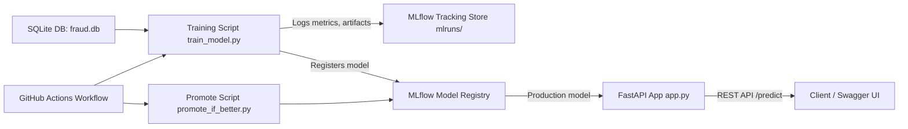

# Fraud Detection MLOps Pipeline

This project demonstrates an end-to-end MLOps workflow for fraud detection using **XGBoost**, **MLflow**, **FastAPI**, **Docker**, and **GitHub Actions**.  
It includes data ingestion, training, experiment tracking, model registry, model promotion, serving, and automated retraining.

---

##  Project Structure

```
fraud_mlops_pipeline/
│── app/
│   ├── app.py                # FastAPI app (serves model from MLflow)
│   ├── feature_names.txt     # Saved feature names from training
│
│── training/
│   ├── train_model.py        # Model training & logging
│
│── ci/
│   ├── promote_if_better.py  # CI script: promote new model if better
│
│── data/
│   ├── fraud_transactions.csv    # Reduced dataset for testing/CI
│   ├── fraud.db                  # SQLite DB created by init_db.py
│   ├── init_db.py                # Script to create database from CSV
│
│── mlruns/                   # MLflow experiment & registry store
│── .env.example              # Example environment variables
│── requirements.txt          # Python dependencies
│── Dockerfile                # Container image for all services
│── docker-compose.yml        # Orchestration of API, training, MLflow UI
│── Makefile                  # Shortcuts (make up, make train, make promote, ...)
│── .github/workflows/mlops.yml # GitHub Actions workflow (automation)
```

---

##  Features

- SQLite for persistent fraud data (`data/fraud.db`)
- MLflow for experiment tracking, model logging, registry, and UI
- XGBoost binary classification model
- Automatic promotion if a new model outperforms Production
- FastAPI REST API with API key authentication
- Docker Compose for reproducible services:
  - **mlflow-ui** → experiment tracking dashboard  
  - **api** → model serving  
  - **trainer** → training job  
  - **promote** → promotion job
- GitHub Actions for CI/CD automation:
  - Scheduled retraining (monthly via cron)  
  - Model promotion  
  - Artifacts upload  

---

##  Local Deployment with Self-Hosted Runner

In the `mlops_deploy_local` branch, the project extends the GitHub Actions workflow to support **local deployment** using a self-hosted runner.  
In this setup, the **training and promotion jobs** run on GitHub-hosted runners as usual, but once a new model is promoted to Production, the workflow triggers an additional **deploy-local** job.  

This job runs on a self-hosted runner installed on the local machine, downloads the updated MLflow registry (`mlruns/`) as an artifact, replaces the local copy, and automatically restarts the FastAPI container.  
As a result, the API service remains continuously reachable over REST with the latest Production model.

### Usage
1. Set up a self-hosted runner on your local machine (see [GitHub’s guide](https://docs.github.com/en/actions/hosting-your-own-runners/adding-self-hosted-runners)).  
2. Start the runner with `./run.sh` and leave it running in the background.  
3. Run the workflow from the **Actions tab** in GitHub (or wait for the scheduled monthly trigger).  
4. After training and promotion complete, the self-hosted runner will update your local `mlruns/` folder and restart the API automatically.  
5. Access the API at [http://localhost:8000/docs](http://localhost:8000/docs).  

This branch is intended as a demonstration of end-to-end automation without cloud infrastructure.  
In production, the same logic can be adapted to use a remote MLflow tracking server and cloud deployment targets (AWS/GCP/Azure), removing the need for artifact syncing.

---

##  Architecture



---

##  Setup

1. **Clone the repository**
   ```bash
   git clone https://github.com/<your-username>/fraud_mlops_pipeline.git
   cd fraud_mlops_pipeline
   ```

2. **Create `.env` file (based on `.env.example`)**
   ```env
   API_KEY=...
   PORT=8000
   MLFLOW_TRACKING_URI=file:///workspace/mlruns
   ```

3. **Build Docker images**
   ```bash
   docker compose build
   ```

---

##  Usage

### Start API + MLflow UI
```bash
docker compose up -d mlflow-ui api
```
- **API:** http://127.0.0.1:8000/docs  
- **MLflow:** http://127.0.0.1:5000  

### Train a model
```bash
docker compose run --rm trainer
```
Logs metrics/artifacts to MLflow and registers the model.

### Promote best model
```bash
docker compose run --rm promote
```
Compares new model with current Production and promotes if better.

### Test the API
```bash
curl -X POST "http://127.0.0.1:8000/predict"   -H "Content-Type: application/json"   -H 'x-api-key: your_key'   -d '{"amount": 0.4, "step": 50, "TRANSFER": 1, "PAYMENT": 0, "CASH_OUT": 0, "DEBIT": 0}'
```

**Expected response:**
```json
{"prediction": 1.0}
```

---

## Automation with GitHub Actions

The project includes a workflow in `.github/workflows/mlops.yml` that automates:

- Running the training pipeline (`train_model.py`)
- Running the promotion logic (`promote_if_better.py`)
- Scheduling retraining automatically once per month (cron job)
- Allowing manual retraining via the **Actions** tab in GitHub

This replaces the need for a heavy local Jenkins setup and runs entirely in GitHub’s cloud infrastructure.

---

##  Developer Shortcuts (Makefile)

Instead of typing long Docker commands, use:
```bash
make up        # start API + MLflow UI
make down      # stop everything
make logs      # tail logs
make train     # run training
make promote   # run promotion
```

---

##  Setting Up and Using the Fraud Detection MLOps Pipeline

This project implements a complete MLOps pipeline for fraud detection using MLflow, Docker Compose, and GitHub Actions.  
The pipeline consists of two jobs: **train-promote** (model training, artifact logging, and promotion) and **deploy-local** (local deployment and API validation).  

### Setup
1. Clone the repository and create a `.env` file (you can start from `.env.example`).  
2. Make sure Docker is installed and running.  
3. Register your secrets (`API_KEY`, `MLFLOW_TRACKING_URI`, `PORT`) in GitHub → *Settings* → *Secrets and variables* → *Actions*.  
4. Configure a self-hosted GitHub Actions runner on your local machine.  

### Usage
- The pipeline runs automatically every month or on manual trigger via GitHub Actions.  
- After training, the latest Production model is deployed locally via Docker Compose.  
- The API becomes available at:  
  [http://localhost:8000](http://localhost:8000)  
  with interactive docs at:  
  [http://localhost:8000/docs](http://localhost:8000/docs)  

### Testing Predictions
Send authenticated POST requests to `/predict`:
```bash
curl -X POST "http://localhost:8000/predict"   -H "Content-Type: application/json"   -H "x-api-key: <your_api_key>"   -d '{"amount": 5000.0, "step": 120, "TRANSFER": 1, "PAYMENT": 0, "CASH_OUT": 0, "DEBIT": 0}'
```
The API will return a JSON response:
```json
{"prediction": 0}
```

This ensures that every retrained model is automatically deployed, validated, and ready for real-world fraud detection scenarios.

---

##  Next Steps

- **Monitoring:** Add Prometheus + Grafana to monitor API latency & drift  
- **CI/CD:** Extend GitHub Actions to build and push Docker images to a registry  
- **Cloud:** Deploy containers to AWS ECS, GCP Cloud Run, or Kubernetes  
